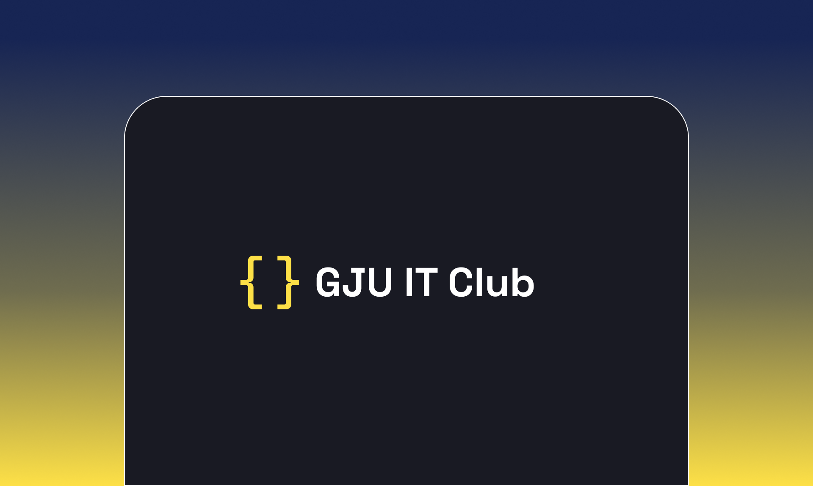

# IT Club Site Landing Page
"GJU IT Club Site" - Built with clean, modern aesthetics and leveraging the power of Astro and Tailwind, it showcases your club's activities, projects, and events, fostering collaboration and knowledge sharing among members.

## Contributions
All Contributions are welcome and encouraged. 

## 🚀 Project Structure

The project is built using Astro.js and Tailwind CSS. Here's a quick look at the project structure:

Astro looks for `.astro` or `.md` files in the `src/pages/` directory. Each page is exposed as a route based on its file name.

There's nothing special about `src/components/`, but that's where we like to put any Astro/React/Vue/Svelte/Preact components.

Any static assets, like images, can be placed in the `public/` directory.

## 🧞 Commands

All commands are run from the root of the project, from a terminal:

| Command                   | Action                                           |
| :------------------------ | :----------------------------------------------- |
| `npm install`             | Installs dependencies                            |
| `npm run dev`             | Starts local dev server at `localhost:4321`      |
| `npm run build`           | Build your production site to `./dist/`          |
| `npm run preview`         | Preview your build locally, before deploying     |
| `npm run astro ...`       | Run CLI commands like `astro add`, `astro check` |
| `npm run astro -- --help` | Get help using the Astro CLI                     |

## 👀 Want to learn more?

Feel free to check [Astro documentation](https://docs.astro.build) or jump into our [Discord server](https://astro.build/chat).

## 📄 License

This project is licensed under the MIT License - see the [LICENSE.md](LICENSE.md) file for details

## Credits
This project was made using [Positivus](https://github.com/manulthanura/Positivus) Theme, along with Graphics from [Storyset](https://storyset.com) and Icons from [Iconify](https://icon-sets.iconify.design/)